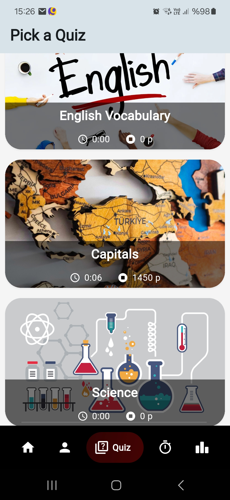
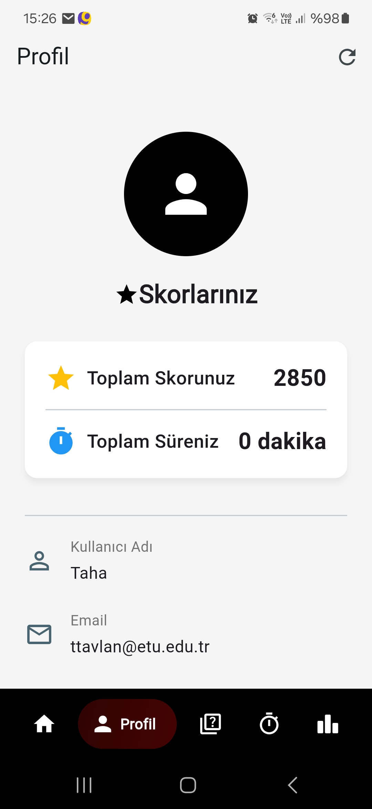
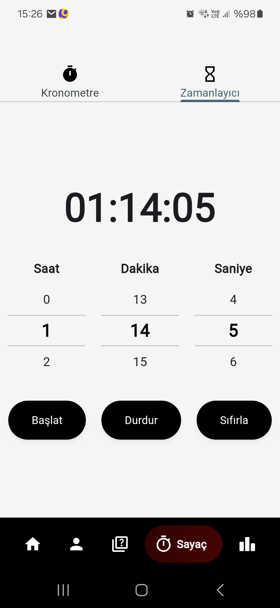
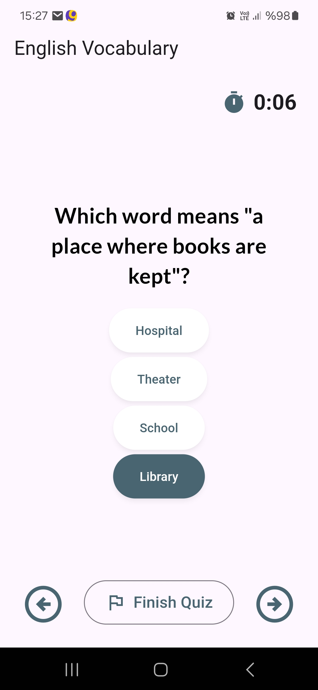
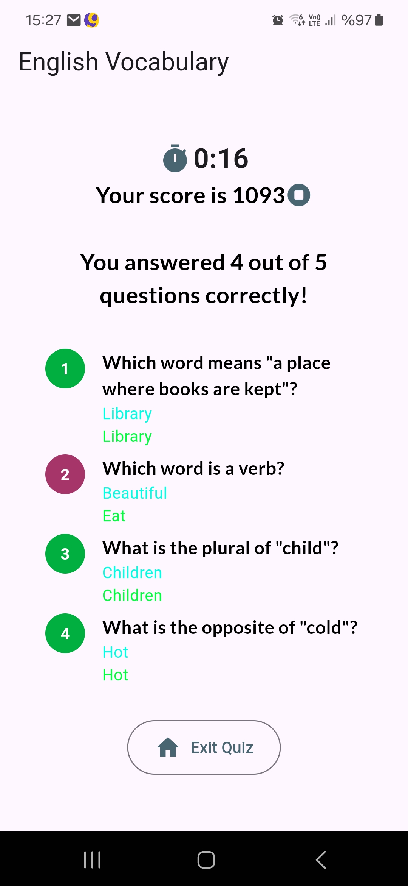

**EduRank

📌 Proje Tanıtımı

EduRank, kullanıcıların test çözerek, çalışma ilerlemelerini takip ederek ve performanslarını analiz ederek verimli bir çalışma süreci oluşturmasını sağlayan mobil tabanlı bir uygulamadır. Kullanıcılar çalışma sürelerini ve başarı oranlarını arkadaşlarıyla karşılaştırabilir, böylece tatlı bir rekabet ortamında motive olabilirler.

🚀 Özellikler

📋 Kullanıcı Kaydı & Girişi: Kullanıcılar hesap oluşturabilir ve kimlik doğrulama mekanizması ile giriş yapabilir.

⏳ Çalışma Süresi Takibi: Sayaç/kronometre ile çalışma süreleri kaydedilebilir.

📝 Test Çözme: Farklı kategorilerde testler çözülebilir.

📊 İstatistik ve Analiz: Kullanıcılar çalışma istatistiklerini ve test sonuçlarını inceleyebilir.

🏆 Lider Tablosu: Kullanıcılar arkadaşlarının çalışma sürelerini ve başarı oranlarını görüntüleyebilir.

📶 Çevrimdışı Mod: İnternet bağlantısı olmadan da çalışma süresi kaydı tutulabilir.

📷 Ekran Görüntüleri

Görselleri proje dizininize eklediğinizden emin olun ve dosya yollarını doğru şekilde ayarlayın.

🛠 Teknolojiler

Bu proje aşağıdaki teknolojiler kullanılarak geliştirilmiştir:

Flutter / Dart (Mobil Geliştirme)

JWT / SQLite, MySQL (Kimlik Doğrulama & Veritabanı)

Node.js / Flask (Backend API)
